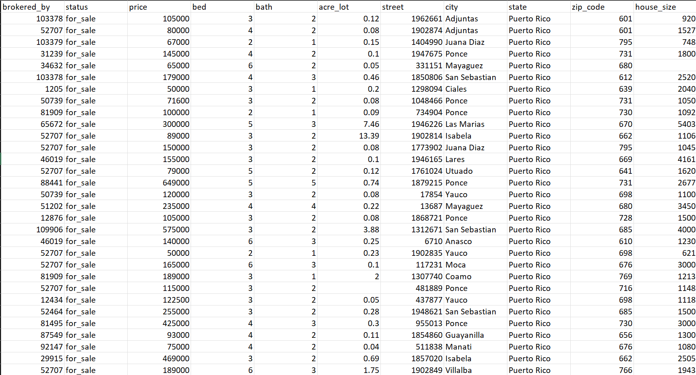
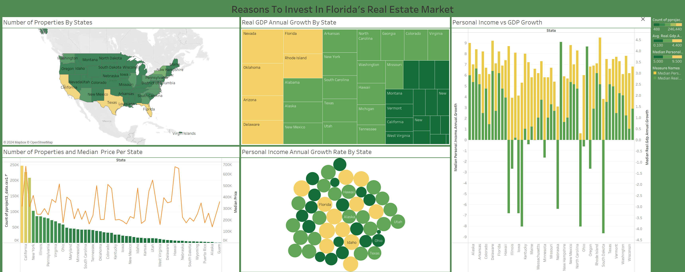

# Where To Invest?: Finding The State That Maximizes Real Estate Return On Investment

## Introduction
As house prices continue to increase across states, knowing which states are the best for maximizing return on investment (ROI) has become a necessity. Real Estate investing  is best done in places where the house pricing is low but the economy is growing. This is because a growing economy is a proxy for business development which is also a proxy for appreciation. So, to evaluate the fitness of a state for real estate investing, the number of houses  and economic growth as shown by GDP are two factors to be examined. Once the top 3 states are selected based on this criteria, return on investment comparison will be made using Zillow’s ROI calculator.

**Concepts Applied**
- Data preprocessing in R
  - Outlier detection
  - Data Merging
  - Data Imputation
- Data visualiaztion in Tableu
  - Dashboarding
  - Graphing
  - Calculating Fields

- Problem Statement
  - What’s currently the best state to maximize ROI in real estate?
  - What states are currently growing economically based on GDP?
  - What states have the people with the highest personal income growth?

----
## Data Preprocessing 
- Data Collection
The dataset used for this project was originally created and posted on Kaggle by Ahmed Shahriar Sakib. The dataset is a collection of listing posted by Realtor.com - A real estate listing website operated by the News Corp subsidiary Move, Inc. and based in Santa Clara, California. It contains 10 classes  and 2,226,382 observations. Some of the features include price, square footage, street, city, state, and so on. The file for this dataset can be found at: https://www.kaggle.com/datasets/ahmedshahriarsakib/usa-real-estate-dataset
- Raw Data Snapshot
  
- Data Cleaning
  - Data points are evaluated for correctness, datatypes, and overall uniformity
  - Outliers are dropped from the dataset
  - Null values are imputed and dropped when needed

- Data Processing
  - Exploratory Analysis
    - Number of property postings by state is mapped 
    - Average house price by state is plotted
    - Real GDP annual growth by state is graphed
    - Personal income annual growth by state is graphed
    - Real GDP and personal income by state are compared

----
## Dashboard

 <a href="[https://the-athlete-in-you-a80cad41e1f9.herokuapp.com/](https://public.tableau.com/views/MaximizingRealEstateROI/ReasonsToInvestInFloridasRealEstateMarket?:language=en-US&:sid=&:redirect=auth&:display_count=n&:origin=viz_share_link)" target="_blank">View In Tableau</a>

----
## Results
- Florida is  the state that consistently comes ahead in housing supply and overall economic growth
- Texas and California are two states that closely follow Florida’s trends
- Florida has 9% and 19% more house listings than the closest competing states, California and Texas, respectively.  This shows that the number of investing opportunities is slightly better in Florida compared to other states
- Florida’s real estate housing has the potential to appreciate better than other states. This is because Florida’s GDP annual growth is 3% compared to 1.2% and 2.54% for California and Texas. This indicates business development that appreciates the real estate value
  
----
## Conclusion and Recommendations
- Real estate investment opportunities can be found in different states but Florida, California, and Texas are three states with the most opportunities for investors
- Currently, Florida is the best state for real estate investing because of the size of the market and its ability to appreciate
- Investing in Florida can yield a 10% increase in ROI compared to the closest competing state (California)

